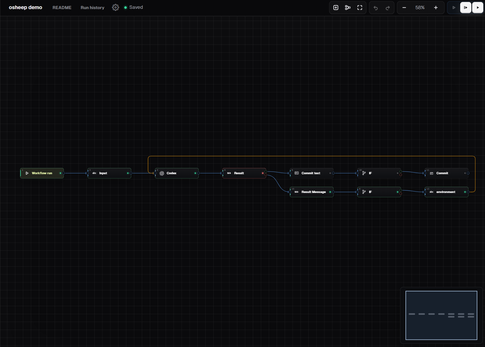
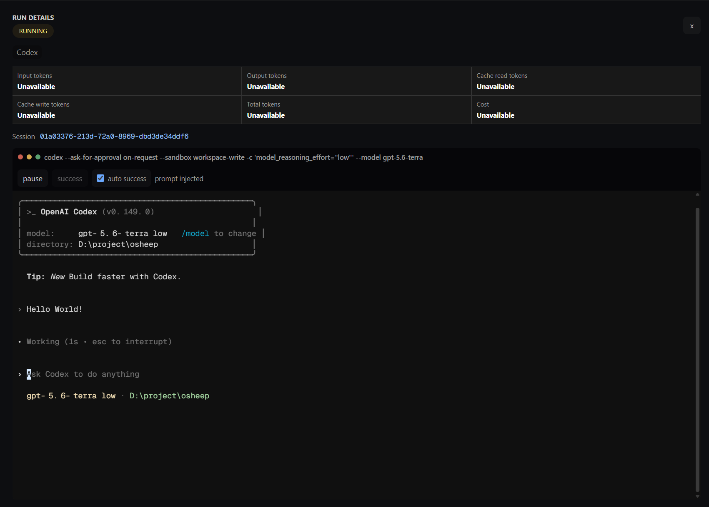

# Osheep

[](https://github.com/psheep303/osheep/actions/workflows/ci.yml)
[](LICENSE)

English | [简体中文](README.zh-CN.md)

**Turn a growing Agent / Harness ecosystem into a simple visual workspace.**

Osheep is a lightweight, local-first workbench for composing AI-assisted work. Put agents,
commands, Git operations, files, APIs, and MCP tools on one canvas; connect their outputs; review
the result; and keep the project in your own machine and repository.

It is deliberately not another chat window. A workflow makes each step visible, reusable, and
controllable without making you learn a new automation platform.

```text
Trigger -> Agent -> Review -> Commit -> Markdown result
             |          |
        Skills / MCP   approve or stop
```

Codex CLI and Claude Code are the built-in adapters today. Osheep's adapter boundary is designed
for more agents and harnesses, whether they run through a CLI, HTTP, or an SDK.

## Why Osheep

- **Visual, without the ceremony**: build workflows by connecting blocks and pass data with simple
  `{{blocks[2].text}}` references.
- **Agent-agnostic by design**: adapters normalize sessions, streaming events, approvals, tools,
  usage, and capabilities instead of coupling the canvas to one CLI.
- **Keep control**: select permissions, inspect live sessions and terminal output, pause at a diff
  or Markdown approval, retry or stop a run, and export a run report.
- **Useful around agents**: work with files, shell commands, HTTP, Remote MCP, JavaScript, Git,
  pull requests, plugins, and skills in the same flow.
- **A real project workbench**: browse and edit code, use an integrated terminal, search the
  workspace, and inspect Git status, diffs, and history without leaving the project context.
- **Local first**: workspaces, workflow files, credentials, and CLI configuration remain on the
  machine running Osheep.
- **Start small, reuse often**: begin with a three-block workflow, save it as a template, or
  install one from the [template marketspace](https://github.com/psheep303/osheep-template-registry).

## In Two Minutes

Install Node.js 20+, npm, and Git. An installed and signed-in agent CLI is optional, but needed to
run its blocks.

```bash
git clone https://github.com/psheep303/osheep.git
cd osheep
npm --prefix backend ci
npm --prefix frontend ci
```

Start Osheep:

```bash
# Linux
chmod +x ./dev.sh
./dev.sh
```

```powershell
# Windows
.\dev.ps1
```

Open <http://127.0.0.1:5173>, choose a workspace, then open **Templates** and run a template or
create a workflow from **Workflow**. The concise [getting started guide](docs/getting-started.md)
and [first workflow tutorial](docs/first-workflow.md) cover the rest.

## Screenshots

The workflow canvas and run details view:





## What You Can Build

- A coding loop: prompt an agent, inspect the diff, approve it, commit, and export the result.
- A research flow: fetch a page or API, extract JSON, send the useful context to an agent, then
  render Markdown.
- A controlled automation: call Remote MCP tools, branch on conditions, transform data, and keep
  a trace of every block.
- A reusable team recipe: save a working graph as a personal template or install a curated
  template from the marketspace.

See [workflow blocks](docs/workflow-blocks.md) for the full reference, and
[agents, skills, templates, and adapters](docs/agents-and-adapters.md) for the surrounding tools.
The [template registry](https://github.com/psheep303/osheep-template-registry) powers the
marketspace; [osheep-template](https://github.com/psheep303/osheep-template) contains examples.

## How It Fits Together

```text
React + Vite workbench
        |
        | HTTP / WebSocket
        v
Fastify runtime ----> files, Git, PTY, MCP, adapters
        ^
        |
Tauri 2 + WebView2 (Windows desktop)
```

The Windows desktop application starts the local backend as a sidecar. The web app runs on Linux
and Windows; the desktop shell currently targets Windows.

## Requirements

- Node.js 20 or later and npm
- Git
- Linux: Python 3 and `build-essential` to compile `node-pty`
- Windows: the C++ build tools needed by `node-pty`
- Optional: one or more supported agent CLIs, installed and signed in

For the Windows desktop application, also install Rust stable, Visual Studio 2022 Build Tools with
the "Desktop development with C++" workload, and Microsoft Edge WebView2 Runtime. See
[desktop/README.md](desktop/README.md).

## Configuration And Safety

Osheep listens on loopback by default. Its local APIs and terminal WebSockets use an Origin-restricted
`HttpOnly` session. Keep it local unless you deliberately operate a protected single-user deployment.

For non-loopback listening, use HTTPS, set an explicit `CORS_ORIGIN`, and set a random
`OSHEEP_AUTH_TOKEN` with at least 32 characters. The shared token is not multi-user authentication;
put remote deployments behind appropriate network and access controls.

Runtime configuration is environment based. [backend/.env.example](backend/.env.example) lists the
available variables. Do not commit `.env`, `backend/.osheep/`, `.codex/`, `.claude/`, private keys,
or cloud credentials. See [SECURITY.md](SECURITY.md) to report a vulnerability privately.

## Documentation

- [Documentation index](docs/README.md)
- [Getting started](docs/getting-started.md)
- [First workflow](docs/first-workflow.md)
- [Workflow block reference](docs/workflow-blocks.md)
- [Agents, skills, templates, and adapters](docs/agents-and-adapters.md)
- [Build an Osheep Adapter](docs/adapter-development.md)

## Development And Contribution

Run the normal checks before opening a pull request:

```bash
npm --prefix backend run lint
npm --prefix backend run typecheck
npm --prefix backend test
npm --prefix frontend run lint
npm --prefix frontend run typecheck
npm --prefix frontend test
```

For Linux, `bash scripts/verify-linux.sh` reproduces the CI path. Read
[CONTRIBUTING.md](CONTRIBUTING.md) for workflow, documentation, template, and Adapter guidance.

## License

Osheep is open source under the [MIT License](LICENSE).
