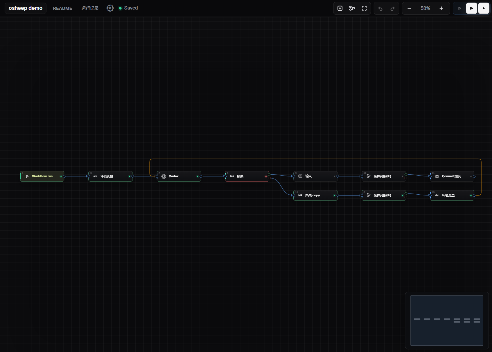
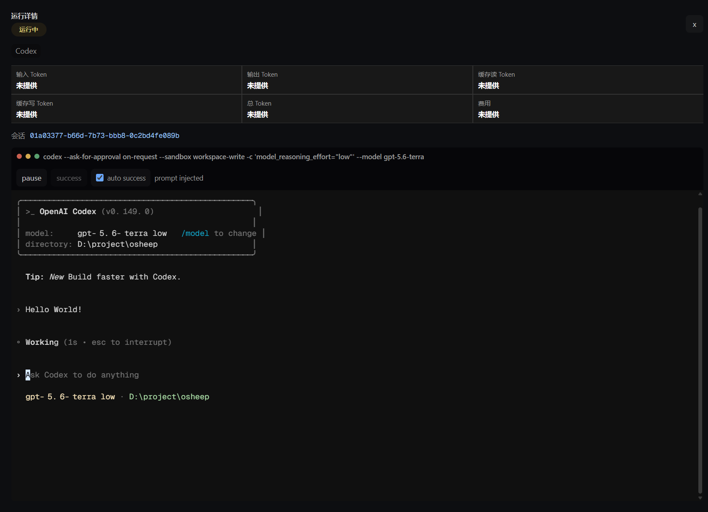

# Osheep

[](https://github.com/psheep303/osheep/actions/workflows/ci.yml)
[](LICENSE)

[English](README.md) | 简体中文

**把复杂的 Agent / Harness 生态，变成一个简单的可视化编排环境。**

Osheep 是轻量、本地优先的 AI 工作流工作台。把 Agent、终端命令、Git、文件、API 与 MCP 工具放到同一张画布，连接它们的输出，审阅结果，并让项目始终留在自己的机器与仓库中。

它不是又一个聊天窗口。工作流让每一步都可见、可复用、可控制，而不要求你学习一套复杂的自动化平台。

```text
触发 -> Agent -> 审查 -> 提交 -> Markdown 结果
           |        |
       Skills / MCP  同意或停止
```

目前内置 Codex CLI 和 Claude Code Adapter。Osheep 的 Adapter 边界面向更广泛的 Agent 与 Harness：无论它们基于 CLI、HTTP 还是 SDK。

## 为什么选择 Osheep

- **可视化，但不繁琐**：连接块即可搭建工作流，用 `{{blocks[2].text}}` 这样直观的引用传递数据。
- **从设计上兼容多种 Agent**：Adapter 将会话、流式事件、审批、工具、用量和能力统一起来，画布不绑定某一个 CLI。
- **始终可控**：设置权限，查看实时会话和终端输出，在 Diff 或 Markdown 审批处暂停，重试或停止运行，并导出运行报告。
- **Agent 之外也好用**：文件、Shell、HTTP、Remote MCP、JavaScript、Git、PR、插件和 Skills 都可放进同一流程。
- **完整的项目工作台**：在项目上下文中浏览和编辑代码，使用集成终端、工作区搜索，并查看 Git 状态、Diff 与历史。
- **本地优先**：工作区、工作流文件、凭据和 CLI 配置保留在运行 Osheep 的机器上。
- **从小开始，随时复用**：先搭一个三块工作流，保存为模板，或从[模板市场](https://github.com/psheep303/osheep-template-registry)安装现成方案。

## 两分钟开始

安装 Node.js 20+、npm 和 Git。安装并登录 Agent CLI 是可选的，但要运行对应 Agent 块则需要它。

```bash
git clone https://github.com/psheep303/osheep.git
cd osheep
npm --prefix backend ci
npm --prefix frontend ci
```

启动 Osheep：

```bash
# Linux
chmod +x ./dev.sh
./dev.sh
```

```powershell
# Windows
.\dev.ps1
```

打开 <http://127.0.0.1:5173>，选择工作区后，可在 **Templates** 运行模板，或在 **Workflow** 新建工作流。接下来只需阅读简短的[快速开始](docs/getting-started.zh-CN.md)和[第一个工作流](docs/first-workflow.zh-CN.md)。

## 界面截图

工作流画布和运行详情页面：





## 可以做什么

- 编码闭环：让 Agent 执行任务，查看 Diff，审批后提交，并导出结果。
- 研究流程：获取网页或 API，提取 JSON，将有用上下文交给 Agent，再输出 Markdown。
- 受控自动化：调用 Remote MCP 工具，按条件分支，转换数据，并保留每个块的运行追踪。
- 可复用配方：把调通的图保存为个人模板，或从模板市场安装精选模板。

完整能力见[工作流块参考](docs/workflow-blocks.md)；Agent、Skills、模板与 Adapter 的说明见[配套能力](docs/agents-and-adapters.zh-CN.md)。模板市场由 [osheep-template-registry](https://github.com/psheep303/osheep-template-registry) 驱动，[osheep-template](https://github.com/psheep303/osheep-template) 提供示例模板。

## 架构

```text
React + Vite 工作台
        |
        | HTTP / WebSocket
        v
Fastify 运行时 ----> 文件、Git、PTY、MCP、Adapter
        ^
        |
Tauri 2 + WebView2（Windows 桌面版）
```

Windows 桌面版会以 sidecar 方式启动本地后端。Web 版支持 Linux 与 Windows；桌面壳目前面向 Windows。

## 环境要求

- Node.js 20 或更高版本、npm
- Git
- Linux：编译 `node-pty` 所需的 Python 3 和 `build-essential`
- Windows：编译 `node-pty` 所需的 C++ 构建工具
- 可选：已安装并登录的受支持 Agent CLI

Windows 桌面版还需要 Rust stable、Visual Studio 2022 Build Tools（“使用 C++ 的桌面开发”工作负载）和 Microsoft Edge WebView2 Runtime，见 [desktop/README.md](desktop/README.md)。

## 配置与安全

Osheep 默认只监听本机回环地址。本地 API 与终端 WebSocket 使用受 Origin 限制的 `HttpOnly` 会话。除非你有明确的受控单用户部署需求，否则请保持本地运行。

如需非本地监听，必须使用 HTTPS，设置明确的 `CORS_ORIGIN`，并设置至少 32 字符的随机 `OSHEEP_AUTH_TOKEN`。该共享令牌不是多用户认证；远程部署应放在合适的网络与访问控制之后。

运行时使用环境变量配置，[backend/.env.example](backend/.env.example) 列出了可用变量。不要提交 `.env`、`backend/.osheep/`、`.codex/`、`.claude/`、私钥或云凭据。安全问题请按 [SECURITY.zh-CN.md](SECURITY.zh-CN.md) 私密报告。

## 文档

- [文档索引](docs/README.md)
- [快速开始](docs/getting-started.zh-CN.md)
- [第一个工作流](docs/first-workflow.zh-CN.md)
- [工作流块参考](docs/workflow-blocks.md)
- [Agent、Skills、模板与 Adapter](docs/agents-and-adapters.zh-CN.md)
- [开发 Osheep Adapter](docs/adapter-development.md)

## 开发与贡献

提交 PR 前运行：

```bash
npm --prefix backend run lint
npm --prefix backend run typecheck
npm --prefix backend test
npm --prefix frontend run lint
npm --prefix frontend run typecheck
npm --prefix frontend test
```

Linux 可运行 `bash scripts/verify-linux.sh` 复现 CI 流程。工作流、文档、模板和 Adapter 的贡献方式请见 [CONTRIBUTING.zh-CN.md](CONTRIBUTING.zh-CN.md)。

## 许可证

Osheep 基于 [MIT License](LICENSE) 开源。
